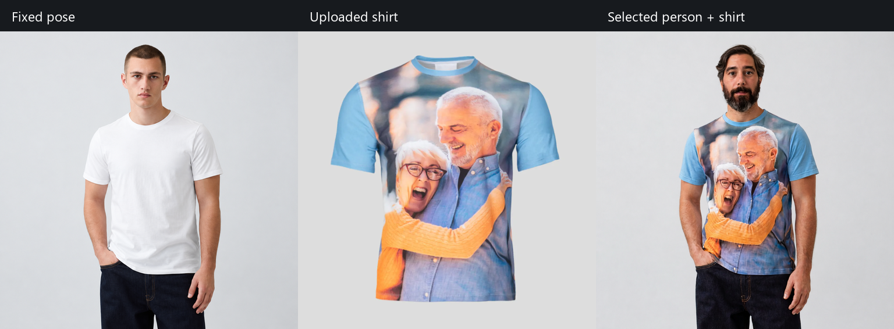

# Demo results

These are selected outputs from the local workflow, exported without embedded ComfyUI workflow, EXIF, or other PNG metadata. Original identity source photos and the training library remain local.

| File | Contents |
| --- | --- |
| [try-on-comparison.png](try-on-comparison.png) | Base pose, garment reference, and generated try-on comparison. |
| [try-on-final-1024.png](try-on-final-1024.png) | Original 1024 × 1024 try-on after skin refinement and background preservation. |
| [try-on-final-4k.png](try-on-final-4k.png) | Final 4096 × 4096 Nomos upscale. |
| [4k-face-comparison.png](4k-face-comparison.png) | Face detail before and after upscaling. |
| [identity-neutral.png](identity-neutral.png) | Earlier identity-swap result preserving the neutral base expression. |
| [skin-refinement-comparison.png](skin-refinement-comparison.png) | Generated results demonstrating skin refinement with the background protected. |

The output is an AI visualization; identity, fit, and printed garment graphics are approximations. Upscaling improves presentation but does not make the result a precise physical fit simulation.

To refresh these files after generating the corresponding local outputs, run `python scripts/export_demo_assets.py` from the repository root using an environment with Pillow installed. The export uses an explicit allowlist and strips metadata while preserving RGB pixels.
